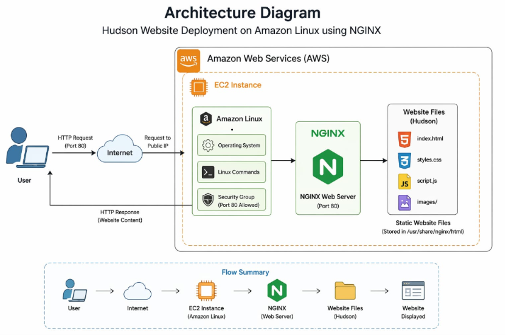
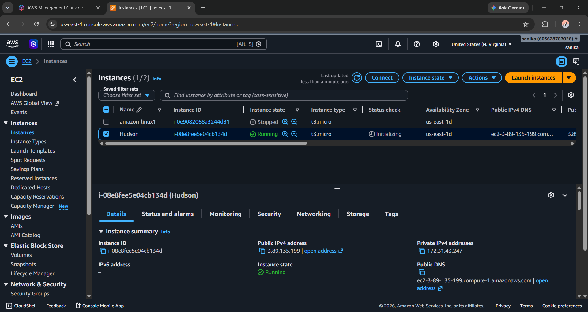
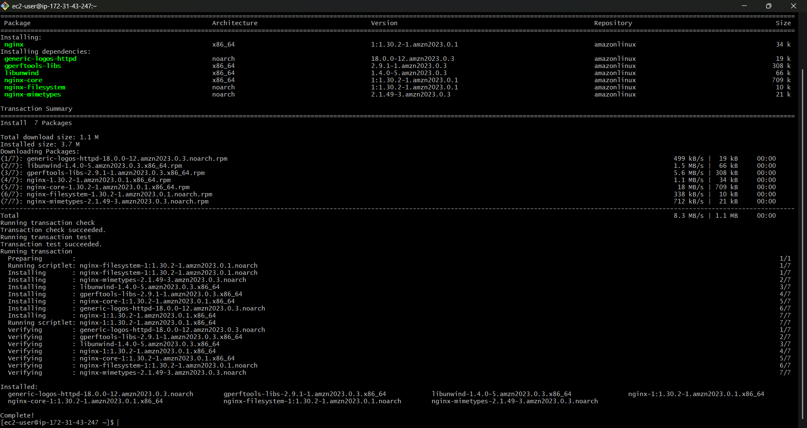
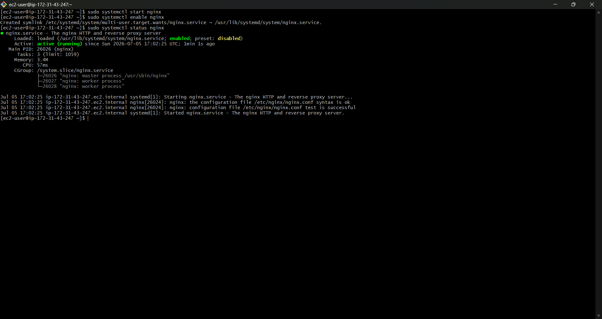
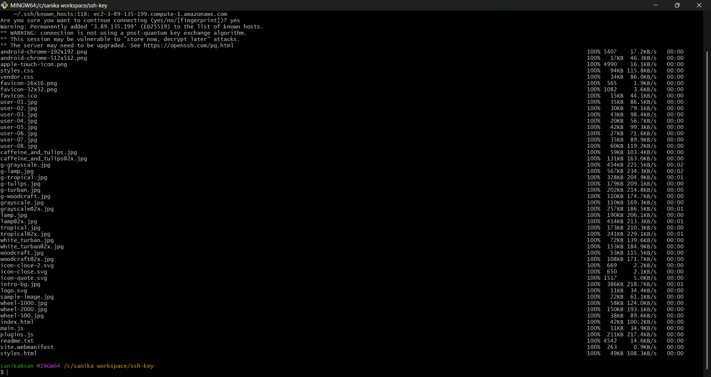
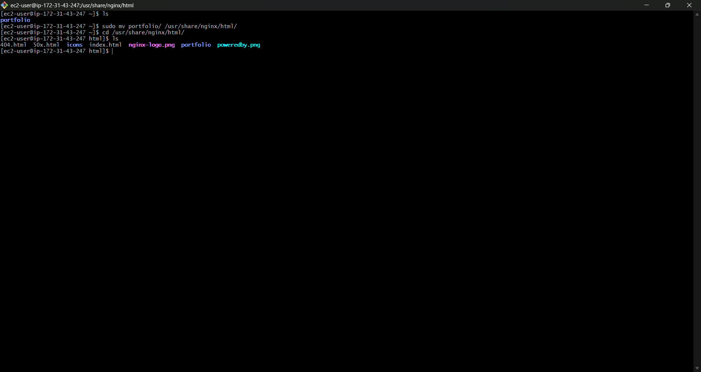
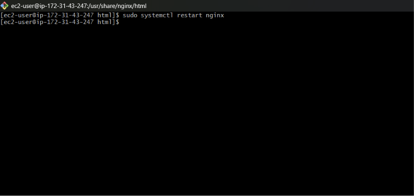

# Hudson Website Deployment using NGINX on Amazon Linux
### Introduction
This is my mini project, where I successfully deployed my static website, **"Hudson,"** on an Amazon Linux server using NGINX. The primary objective of this project was to learn the practical process of website deployment in a real-world environment. It involved configuring the server, installing and setting up NGINX, and hosting the website so it could be accessed through the server's public IP address.
### Technologies Used
* Amazon Linux (EC2)
* NGINX Web Server
* HTML, CSS
* Linux Commands
### Features
* Simple static website deployment
* NGINX server configuration
* Accessible through public/private IP
* Beginner-friendly DevOps project
### Architecture Overview

## Steps I Followed
### 1.. Launch Amazon Linux Instance
* create an EC2 instance

* Connected using SSH

### 2.Install NGINX
sudo yum update -y 
sudo yum install nginx -y

### 3.Start NGINX Server
sudo systemctl start nginx 
sudo systemctl enable nginx

### 4.Deploy Website Files
* Open Git Bash(Terminal)
* Run the SCP command to copy project files to the EC2 instance
scp -i my-noth-virginia-key.pem -r portfolio/ ec2-user@3.89.135.199:/home/ec2-user/
* copied project files

### 4.Moved my website files to nginx directory
* cd /usr/share/nginx/html

### 5.Restart Server
* sudo systemctl restart nginx

### 6.Access Website
* Open browser
* Enter Public IP of instance
* Website "Hudson" is live 

## What i Learned
* Basics of cloud computing 
* How to configure NGINX 
* How to deploy a website on server 
* Linux command usage 
## Project Summary 
This project helped me gain practical knowledge of website deployment and gave me confidence to explore
more in DevOps and Cloud Computing.